<h1 align="center" style="margin: 30px 0;">
     
    Sistema de Gestão para Observações Pedagógicas
</h1>

    Trabalho de Conclusão do Curso de Bacharelado em Ciência da Computação. 
    Gabriela Marangoni Radigonda 
    Orientador: Prof. Rafael Liberato 
    <i>Fevereiro de 2025</i> 

 

Este sistema foi desenvolvido para auxilar a Coordenação e os Professores do Curso Técnico Integrado do Campus de Campo Mourão no acompanhamento pedagógico e disciplinar dos alunos.

<b>
<h1>Sumário</h1>
    
<ul>
<li><a href="#introdução">INTRODUÇÃO</a>  </li>
<li><a href="#cenario-acompanhamento-de-alunos-autistas">Cenário: Acompanhamento de Alunos Autistas</a>  </li>
<li><a href="#documentação">DOCUMENTAÇÃO</a>  </li>
<li><a href="#diagrama-de-caso-de-uso-do-sistema">Diagrama de Caso de Uso do Sistema</a>  </li>
<li><a href="#banco-de-dados">BANCO DE DADOS</a>  </li>
<li><a href="#interface-do-sistema-de-gestao-para-observacoes-pedagogicas-telas-e-finalidades">INTERFACE DO SISTEMA DE GESTÃO PARA OBSERVAÇÕES PEDAGÓGICAS: TELAS E FINALIDADES</a>  </li>
<li><a href="#visão-do-professor">Visão do professor</a>  </li>
<li><a href="#visão-do-coordenação">Visão da coordenação</a>  </li>
<li><a href="#arquitetura">ARQUITETURA</a>  </li>
<li><a href="#tecnologias">Tecnologias</a>  </li>
<li><a href="#instalação">INSTALAÇÃO</a>  </li>

# INTRODUÇÃO

A Universidade Tecnológica Federal do Paraná (UTFPR), criada em 1909 como Escola de Aprendizes e Artífices, passou por importantes transformações, tornando-se Centro Federal de Educação Tecnológica (CEFET-PR) em 1978 e Universidade Tecnológica em 2005. Apesar da mudança, o campus de Campo Mourão manteve o ensino técnico, atualmente ofertado no Curso Técnico Integrado em Informática para Internet, que combina disciplinas do Ensino Médio com formação técnica.

A transformação em universidade trouxe desafios à coordenação do curso, especialmente no acompanhamento dos adolescentes, que vivem uma fase de transições cognitivas, físicas e emocionais. Essa realidade exige maior apoio psicossocial e envolvimento das famílias.

Em um ambiente tradicional, o conselho de classe é uma ferramenta essencial para identificar dificuldades, acompanhar o desempenho escolar, oferecer suporte e definir estratégias pedagógicas. Porém, a estrutura organizacional da universidade, com professores de diferentes departamentos, dificulta a implementação de um modelo tradicional do mesmo.  

Diante deste cenário, o Sistema de Gestão para Observações Pedagógicas foi desenvolvido para suprir essa necessidade, proporcionando um espaço estruturado para registrar e acompanhar observações sobre os alunos. O sistema não substitui o conselho de classe, mas oferece um meio contínuo para que a coordenação e os professores monitorem o desempenho dos estudantes, criem grupos de acompanhamento e compartilhem informações relevantes por meio das observações registradas. Dessa forma, facilita a identificação de dificuldades e a implementação de estratégias pedagógicas mais eficazes.

Entre os principais objetivos do sistema, destacam-se:

- Permitir que a coordenação e os professores registrem e compartilhem observações sobre o desempenho e comportamento dos alunos, facilitando o acompanhamento individual.
- Criar grupos de monitoramento, onde os professores e a coordenação podem adicionar alunos para acompanhamento específico, registrando e acessando observações relacionadas a cada estudante dentro do grupo.

### Cenário: Acompanhamento de Alunos Autistas 
Em uma universidade, um professor leciona para diversas turmas em períodos diferentes e tem alunos autistas matriculados em suas disciplinas. Como esses alunos possuem necessidades específicas e desafios distintos, é essencial que o professor consiga registrar e acompanhar suas dificuldades, progresso e adaptações necessárias ao longo do semestre.

Com o Sistema de Gestão para Observações Pedagógicas, esse professor pode:

1- Criar Grupos de Monitoramento 
- Caso perceba que vários alunos autistas enfrentam desafios semelhantes, o professor pode criar um grupo específico para monitoramento desses estudantes, facilitando o acompanhamento das estratégias adotadas e a troca de informações com outros docentes.

2 - Registrar Observações Individuais
- Durante as aulas, sempre que notar um comportamento relevante, dificuldade acadêmica ou necessidade de adaptação, o professor pode registrar uma observação sobre o aluno diretamente no sistema.

3 - Notificação para Professores e Coordenação
- Sempre que uma nova observação for adicionada sobre um aluno, todos os professores que o possuem em grupos de  monitoramento serão notificados.
- Além disso, a coordenação também recebe a notificação, mesmo que o aluno não esteja em um grupo criado por ela, garantindo uma visão ampla do acompanhamento acadêmico.

4 - Acessar um Histórico Completo
- O sistema permite que tanto professores quanto a coordenação acessem um histórico completo das
 observações feitas anteriormente sobre um aluno, tanto por ele quanto por outros professores, para entender melhor o histórico acadêmico e comportamental desse estudante ao longo do tempo.

5 - Facilitar na Comunicação
- Com todas as informações registradas e acessíveis, a coordenação pode tomar decisões mais assertivas e sugerir intervenções quando necessário, além de fornecer suporte adequado aos professores.

Dessa forma, o sistema permite um acompanhamento mais estruturado e eficaz dos alunos autistas, garantindo que cada professor tenha acesso às informações necessárias para oferecer o suporte adequado, mesmo que esses estudantes estejam distribuídos em diferentes períodos e disciplinas.

## DOCUMENTAÇÃO

### Diagrama de Caso de Uso do Sistema  

Para melhor compreensão das funcionalidades do sistema, a Figura a seguir apresenta o Diagrama de Caso de Uso, destacando os processos utilizados pelo professor e pela coordenação.
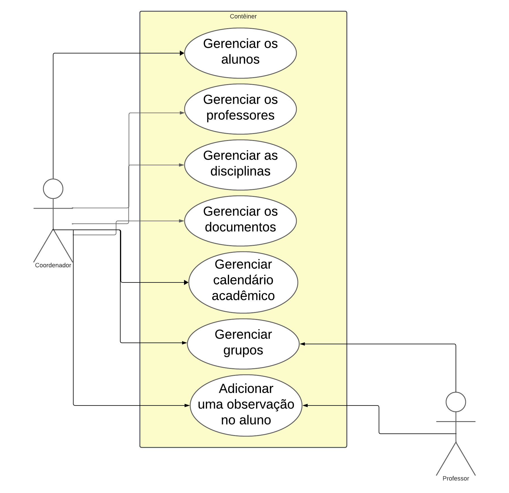
A seguir, são detalhadas as principais ações disponíveis no sistema:

- **Gerenciar os alunos inativos** (Coordenação): Tela onde ficam os alunos deletados, permitindo acesso ao histórico e a opção de restaurá-los.
- **Gerenciar os alunos** (Coordenação): Cadastra novos alunos no sistema.
- **Gerenciar os professores** (Coordenação): Cadastra novos professores no sistema.
- **Gerenciar as disciplinas** (Coordenação): Cadastra e administra as disciplinas disponíveis.
- **Gerenciar os documentos** (Coordenação): Cadastra e organiza documentos institucionais.
- **Gerenciar o calendário acadêmico** (Coordenação): Registra e mantém atualizado o link do calendário acadêmico.
- **Gerenciar grupos** (Professores e Coordenação): Cria grupos de monitoramento para acompanhamento dos alunos.
- **Adicionar uma observação ao aluno** (Professores e Coordenação): Registra observações sobre o desempenho e comportamento dos alunos.

# BANCO DE DADOS

O banco de dados foi modelado para armazenar e gerenciar informações sobre usuários, professores, alunos, disciplinas, calendário acadêmico, grupos de monitoramento e documentos.

- Usuários (USER): Contém credenciais de login (email e senha) e um identificador que diferencia coordenador.
- Professores (PROFESSOR): Associados a um usuário, armazenam informações como nome e telefone.
- Estudantes (ESTUDANTE): Identificados pelo RA, possuem informações de contato e status de exclusão.
- Disciplinas (DISCIPLINA): Contêm o nome e o ano da disciplina, podendo ser associadas a professores ou alunos futuramente.
- Calendário (CALENDARIO): Registra links de calendários acadêmicos com datas associadas.
- Documentos (DOCUMENTO): Armazena arquivos cadastrados no sistema, contendo um título, descrição, link e data de criação.
- Relacionamento entre Professores e Alunos (PROF_ALUNO): Tabela intermediária que conecta professores a alunos, permitindo monitoramento individual.
- Grupos (GRUPO): Criados por um usuário para acompanhar alunos específicos, registrando observações e notificações.

A modelagem segue boas práticas de normalização, utilizando UUIDs para garantir unicidade nos identificadores e facilitar escalabilidade. O diagrama abaixo ilustra os relacionamentos entre as tabelas e como os dados estão organizados no sistema.

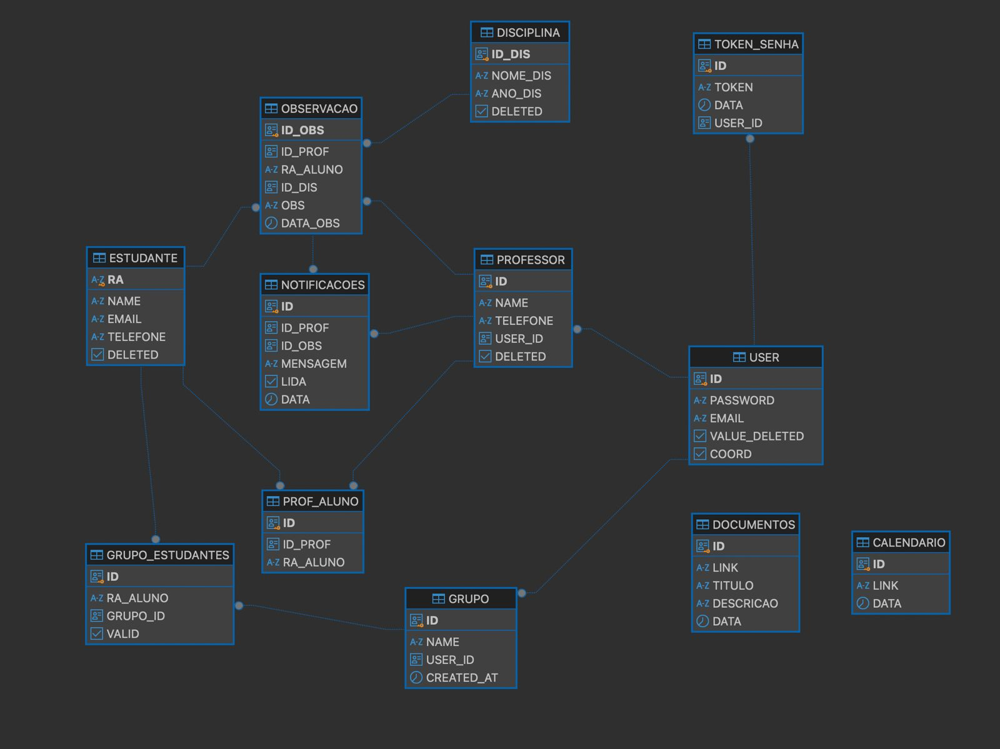

# INTERFACE DO SISTEMA DE GESTÃO PARA OBSERVAÇÕES PEDAGÓGICAS: TELAS E FINALIDADES

O Sistema de Gestão para Observações Pedagógicas foi desenvolvido para proporcionar um ambiente organizado e funcional, permitindo que professores e coordenação acompanhem o desempenho dos alunos.

## Visão do professor
Os professores podem criar grupos de monitoramento para acompanhar mais de perto determinados alunos e registrar observações sobre seu desempenho e comportamento. Sempre que uma nova observação é feita sobre um aluno que faz parte de um grupo, um e-mail é enviado automaticamente para o usuário, notificando-o sobre a nova observação recebida, garantindo um acompanhamento mais ágil e eficiente.

 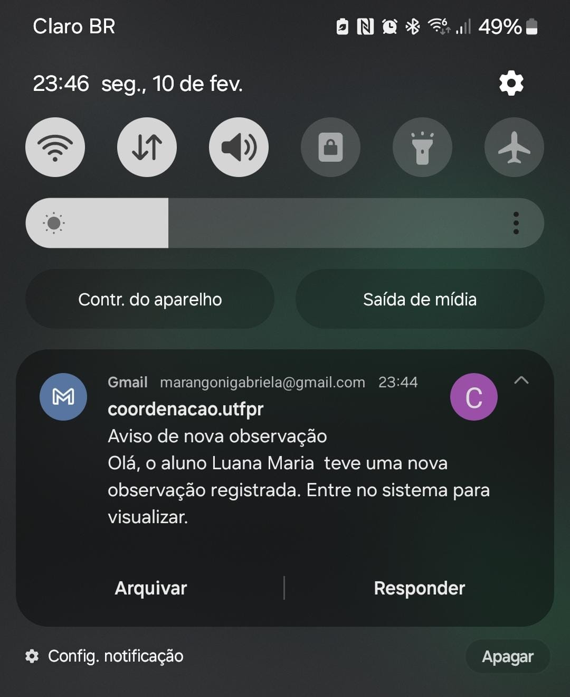 

A seguir, são apresentadas as telas do sistema, destacando suas principais funcionalidades:

### Dashboard
A tela de Dashboard exibe um resumo do sistema, incluindo a quantidade de alunos, professores e disciplinas cadastradas, além de permitir o monitoramento dos grupos e das observações.

 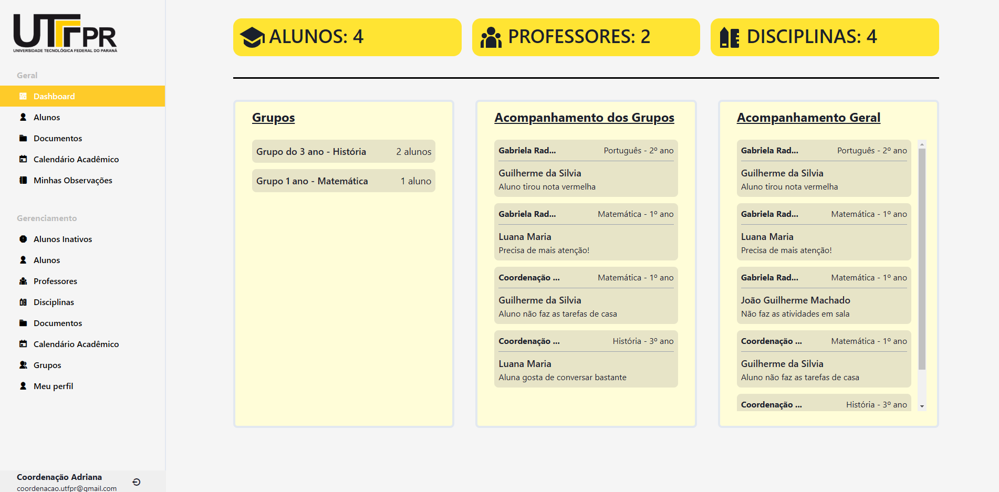 

- Grupo: No primeiro card, são exibidos todos os grupos criados pelo usuário, juntamente com a quantidade de alunos em cada um. Ao selecionar um grupo, o usuário é redirecionado para a tela de observações daquele grupo, onde pode visualizar todas as observações já registradas para os alunos e adicionar novas, se necessário. Note que as observações feitas pelo usuário logado estão destacadas em amarelo, facilitando sua identificação.

 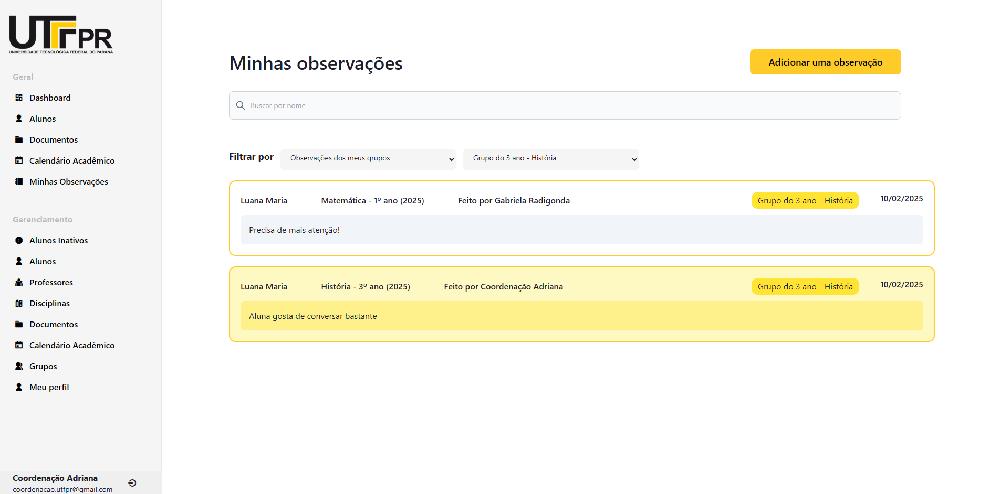 

- Acompanhamento dos Grupos: No segundo card, são listadas as 10 últimas observações feitas nos alunos monitorados pelo usuário. Ao clicar em uma observação, o usuário é redirecionado para a tela do histórico do aluno, onde pode visualizar todas as observações registradas. Nessa tela, além do nome do aluno em destaque, as observações são exibidas com o nome da disciplina, o período e o usuário que fez o registro. Caso o aluno pertença a algum grupo, essa informação também será exibida. Além disso, o usuário pode adicionar uma nova observação para o aluno. Lembrando que as observações feitas pelo usuário logado estão destacadas em amarelo, facilitando sua identificação.

 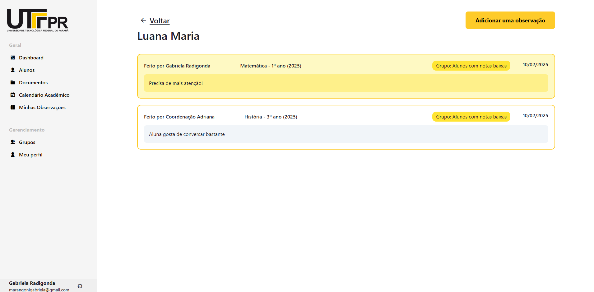 

- Acompanhamento Geral: No terceiro card, são listadas as 10 últimas observações feitas em todos os alunos cadastrados. Ao clicar em uma observação, o usuário é redirecionado para a mesma tela do card "Acompanhamento dos Grupos", onde pode visualizar os detalhes e adicionar novas observações.

### Grupos
A tela "Grupos" permite a criação e o monitoramento de alunos em grupos específicos. Nela, são exibidos todos os grupos cadastrados, juntamente com:

- Nome do grupo;
- Data de criação;
- Alguns alunos do grupo;
- Número total de alunos.

Também é possível editar ou excluir um grupo.

 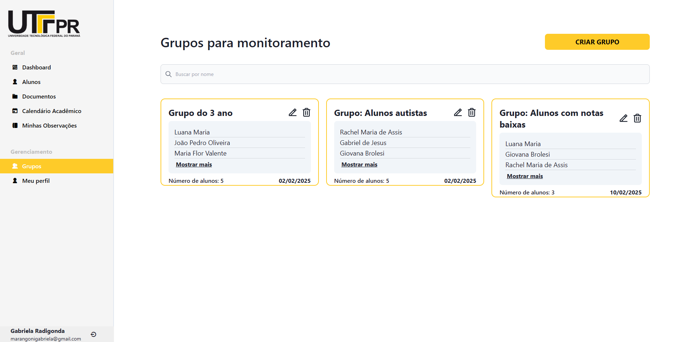 

Ao clicar no botão "Mostrar mais", o usuário é direcionado para uma tela detalhada do grupo, onde pode visualizar uma tabela completa contendo:

- A lista de todos os alunos pertencentes ao grupo;
- A quantidade de observações recebidas por cada aluno.

Opções para:
- Remover um aluno do grupo;
- Visualizar todas as observações registradas para um aluno;
- Adicionar uma nova observação diretamente no sistema.

Além disso, nesta tela, há um botão dedicado para editar o grupo, permitindo que o usuário altere informações como nome e composição do grupo.

 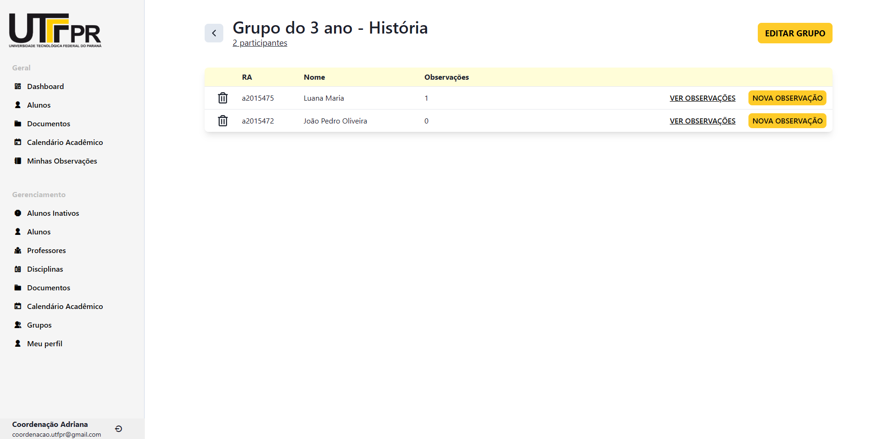 

### Minhas Observações
A tela 'Minhas Observações' permite ao usuário visualizar todas as observações que ele registrou, independentemente de o aluno estar em um grupo ou não. Além disso, é possível acessar as observações de todos os alunos e filtrar especificamente aquelas dos alunos que estão sendo monitorados em um grupo específico. Nesta tela, o usuário também pode adicionar uma nova observação. 

Na tela principal, são exibidas exclusivamente as observações registradas pelo usuário logado.

 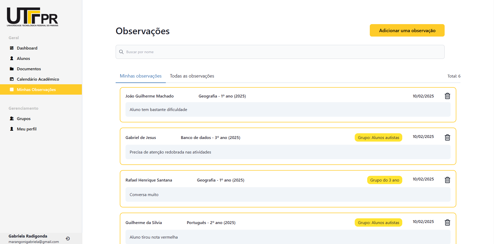 

Ao clicar em "Todas as observações", um seletor é exibido com duas opções: "Observações de todos os alunos" e "Observações dos meus grupos". Por padrão, a opção "Observações de todos os alunos" é selecionada, exibindo todas as observações registradas para qualquer aluno, independentemente de estarem em um grupo criado pelo usuário.

  

Ao selecionar a opção "Observações dos meus grupos", a tela passa a exibir exclusivamente as observações dos alunos que fazem parte de algum dos grupos criados pelo usuário, facilitando o acompanhamento direcionado desses estudantes.

 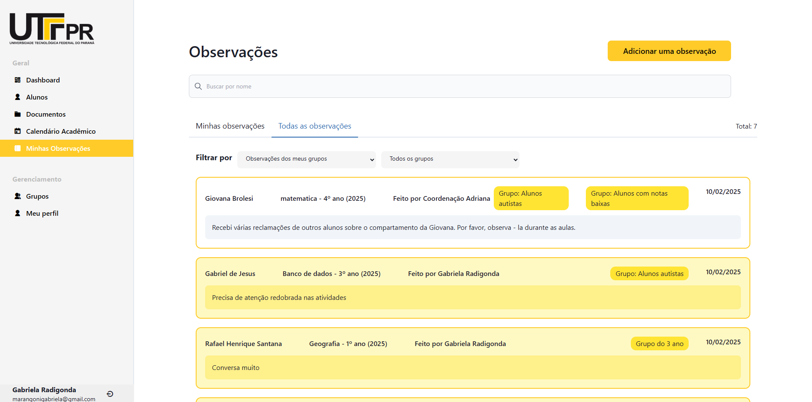 

Ao selecionar a segunda opção do select ("Observações dos meus grupos"), um segundo select é exibido automaticamente. Nele, o usuário pode optar por visualizar as observações de todos os grupos (que vem por padrão) ou filtrar por um grupo específico.

 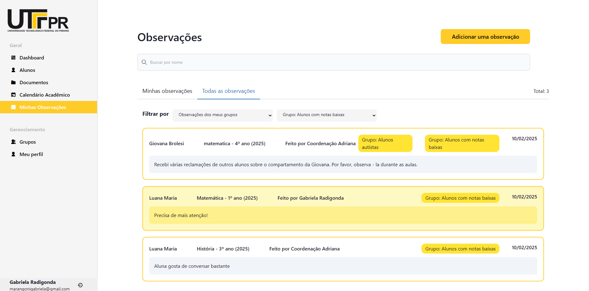 

### Alunos
A tela de Alunos exibe a lista de todos os alunos cadastrados no sistema, apresentando as seguintes informações: RA, nome, telefone, e-mail e a quantidade de observações registradas para cada aluno. Além disso, conta com uma barra de pesquisa, permitindo localizar rapidamente um aluno pelo nome.

 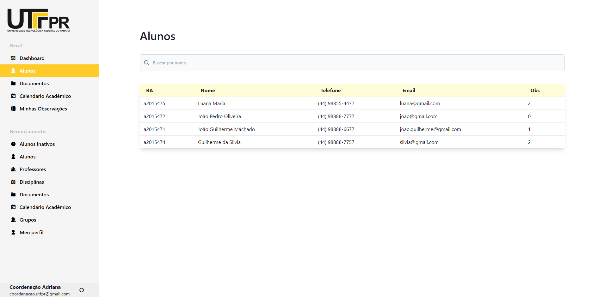 

 Ao clicar em um aluno, o usuário é redirecionado para a tela do histórico do aluno, onde pode visualizar todas as observações registradas. Nessa tela, além do nome do aluno em destaque, as observações são exibidas com o nome da disciplina, o período e o usuário que fez o registro. Caso o aluno pertença a algum grupo, essa informação também será exibida. Além disso, o usuário pode adicionar uma nova observação diretamente ao aluno. Lembrando que as observações feitas pelo usuário logado estão destacadas em amarelo, facilitando sua identificação.

  

### Meu Perfil
Na tela "Meu Perfil", é possível:

- Visualizar o nome e o e-mail cadastrados, sendo somente para consulta;
- Alterar a senha, caso necessário, garantindo mais segurança para o usuário.

 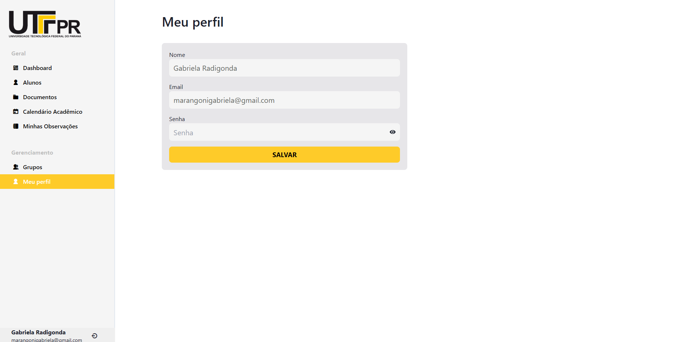 

### Calendário Acadêmico
A tela de Calendário Acadêmico permite o acesso ao calendário oficial do curso. Ao clicar na opção disponível, o usuário é redirecionado para uma nova aba com o calendário cadastrado pela coordenação, sem visualizar diretamente o link no sistema.

 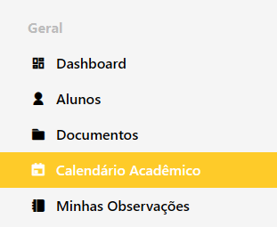 

### Documentos
A tela de Documentos permite a visualização de todos os arquivos cadastrados no sistema. Nela, os usuários podem acessar, consultar e fazer o download dos documentos disponibilizados pela coordenação. A tela facilita a organização e o acesso rápido a materiais importantes para a gestão acadêmica.

  

## Visão da coordenação
A coordenação, além de contar com todas as funcionalidades disponíveis para os professores, possui acesso a ferramentas administrativas, como o gerenciamento de alunos, professores, disciplinas, documentos e calendário acadêmico. Essas funcionalidades estão destacadas na imagem a seguir com um retângulo vermelho. Além disso, a coordenação recebe notificações sobre todas as novas observações registradas, independentemente de estar ou não em um grupo de monitoramento, garantindo um acompanhamento mais amplo do desempenho dos alunos. Para a coordenação, os grupos funcionam apenas como uma forma prática de organizar os alunos que deseja acompanhar de perto.

 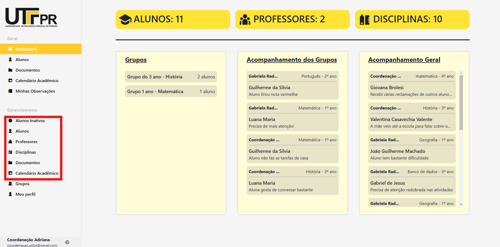 

A seguir, são apresentadas as telas exclusivas da coordenação, destacando suas principais funcionalidades administrativas:

### Cadastro de Alunos
Na tela "Cadastro de Alunos", a tela inicial exibe uma tabela com os alunos já cadastrados, acompanhada de uma barra de pesquisa para localizar um aluno pelo nome. Além disso, há dois botões principais: "Cadastrar" e "Excluir Vários".

Os alunos cadastrados podem ter seus dados editados (exceto o RA) ou serem excluídos manualmente.

 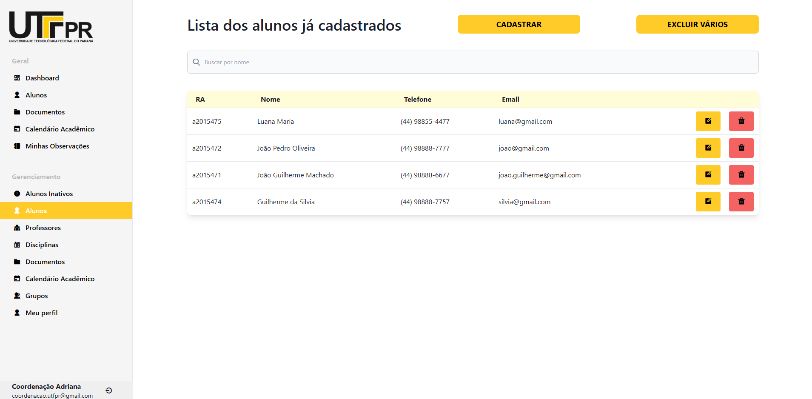 

- Ao clicar em "Cadastrar", o usuário é redirecionado para a tela de cadastro, onde pode optar por cadastrar um único aluno manualmente ou realizar um cadastro coletivo. 

 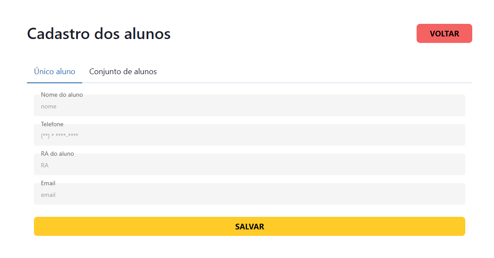 

A tela de "Conjunto de Alunos" permite à coordenação registrar grupos de estudantes de forma rápida e organizada. Como não foi possível integrar o sistema diretamente ao da UTFPR, essa funcionalidade foi desenvolvida para otimizar o processo manual. A coordenação deve baixar o arquivo CSV com os dados dos alunos, copiar as informações necessárias para uma planilha seguindo a ordem correta e, em seguida, colá-las no sistema, garantindo um cadastro eficiente e estruturado. Os dados devem ser inseridos no formato: RA, nome, telefone e e-mail, com cada aluno em uma linha e os campos separados por vírgulas.

 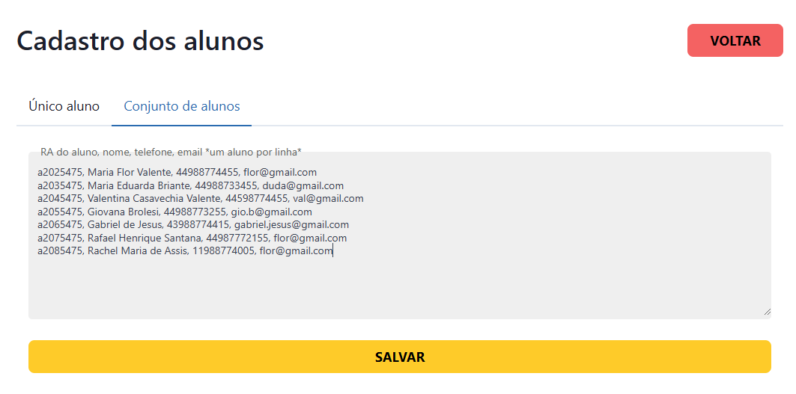 

- Ao clicar em "Excluir Vários", o usuário é levado para a tela de exclusão coletiva, onde pode remover múltiplos alunos cadastrados. Para isso, basta copiar e colar uma lista de RAs, um aluno por linha.

 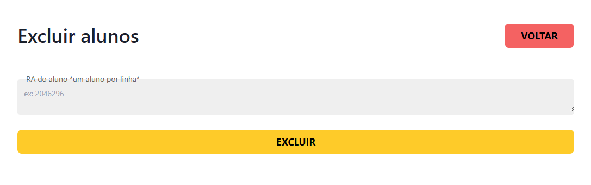 

### Alunos Inativos
A tela 'Alunos Inativos' exibe a lista de alunos que foram deletados. Quando um aluno é removido, seus dados são armazenados nessa tela, permitindo a visualização de todas as observações registradas para ele. Além disso, tem a opção de reativar o aluno, restaurando seus dados ao sistema.

  

### Cadastro de Professores 
Na tela "Cadastro de Professores", a coordenação pode visualizar uma tabela com todos os professores já cadastrados, além de uma barra de pesquisa para localizar um docente pelo nome. Para adicionar um novo professor, basta clicar no botão "Cadastrar". Após o cadastro, o sistema envia automaticamente um e-mail ao professor com um link para redefinição de senha, garantindo um acesso seguro à plataforma.

Os professores cadastrados podem ter seus dados editados pela coordenação (exceto o e-mail) ou serem excluídos manualmente.

 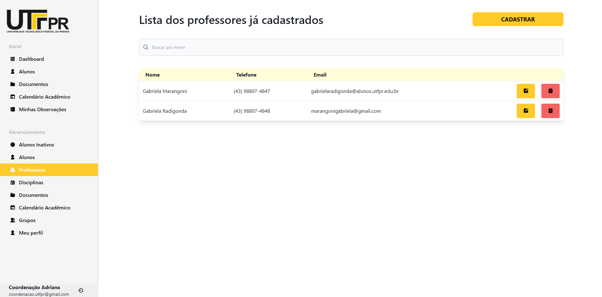 

- Ao clicar em "Cadastrar", o usuário é redirecionado para a tela de cadastro, onde pode optar por cadastrar um único professor manualmente ou realizar um cadastro coletivo. 

 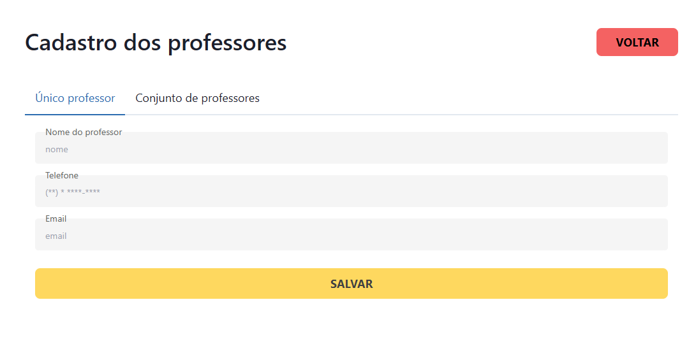 

A tela de "Conjunto de Professores" permite à coordenação registrar grupos de professores de forma rápida e organizada. Como não foi possível integrar o sistema diretamente ao da UTFPR, essa funcionalidade foi desenvolvida para otimizar o processo manual. A coordenação deve baixar o arquivo CSV com os dados dos professores, copiar as informações necessárias para uma planilha seguindo a ordem correta e, em seguida, colá-las no sistema, garantindo um cadastro eficiente e estruturado. Os dados devem ser inseridos no formato: nome, telefone e e-mail, com um professor por linha e os dados separados por vírgulas.

 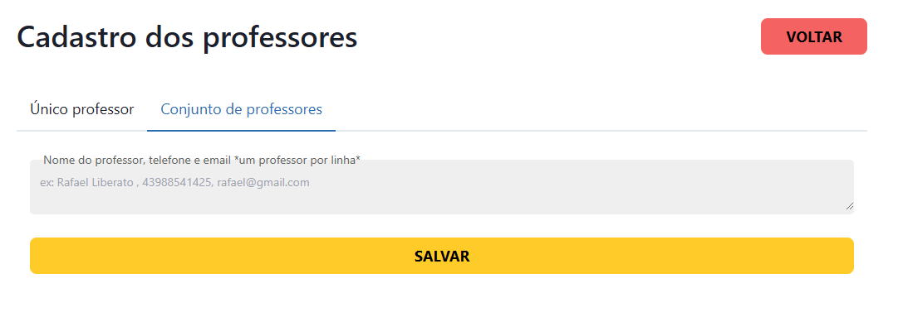 

### Cadastro de Disciplinas 
Na tela "Cadastro de Disciplinas", a tela inicial exibe uma tabela com as disciplinas já cadastradas, juntamente com uma barra de pesquisa para localizar uma disciplina pelo nome. Há também um botão principal: "Cadastrar".

As disciplinas cadastradas podem ter todos os seus dados editados, e a exclusão deve ser feita manualmente.

 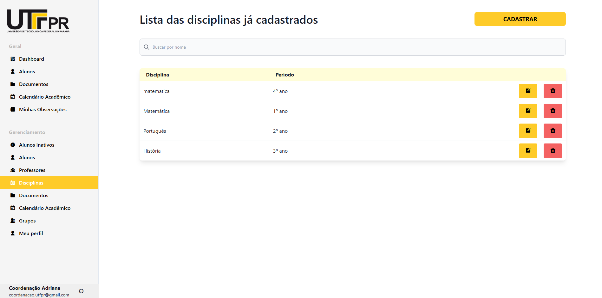 

Ao clicar em "Cadastrar", o usuário é redirecionado para a tela de cadastro, onde pode optar por cadastrar uma única disciplina manualmente ou realizar um cadastro coletivo. 

Para isso, basta copiar e colar os dados diretamente na tela, seguindo o formato: nome da disciplina e período, com uma disciplina por linha e os dados separados por vírgulas.

 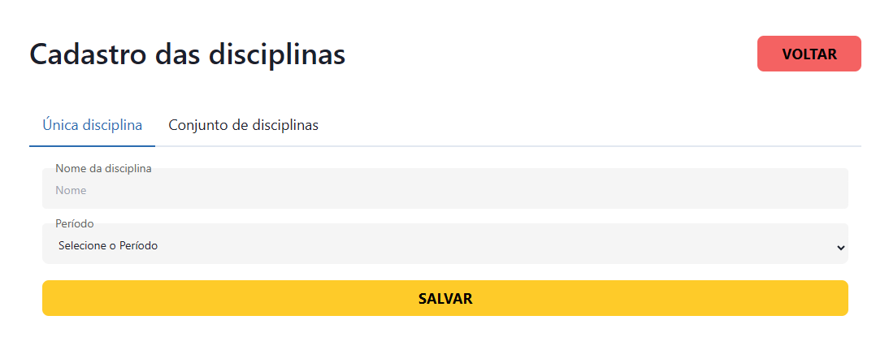 

A tela de "Conjunto de Disciplinas" permite à coordenação registrar conjuntos de disciplinas de forma rápida e organizada. Como não foi possível integrar o sistema diretamente ao da UTFPR, essa funcionalidade foi desenvolvida para otimizar o processo manual. A coordenação deve baixar o arquivo CSV com os dados das disciplinas, copiar as informações necessárias para uma planilha seguindo a ordem correta e, em seguida, colá-las no sistema, garantindo um cadastro eficiente e estruturado. Os dados devem ser inseridos no formato: nome da disciplina e período (números de 1 a 4), com uma disciplina por linha e os dados separados por vírgulas.

 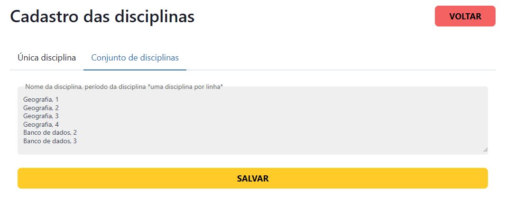 

### Cadastro do Calendário Acadêmico
Na tela "Cadastro do Calendário Acadêmico", a coordenação cadastra o link do calendário, permitindo que, ao ser clicado na seção "Calendário Acadêmico" do sistema, o usuário seja redirecionado automaticamente para o documento ou página correspondente.

Caso precise editar o link posteriormente, basta acessar essa tela e atualizar a informação.

 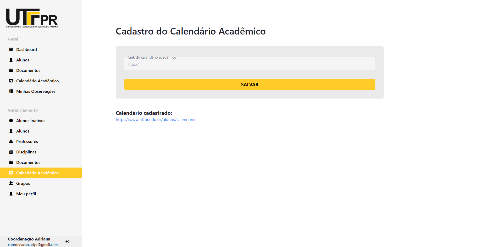 

### Cadastro de Documentos 
Na tela "Cadastro de Documentos", é possível visualizar uma lista com todos os documentos já cadastrados.

  

Ao clicar no botão "Cadastrar",o usuário é redirecionado para a tela de cadastro. Nessa tela, o usuário pode adicionar um novo documento informando: titulo do documento, descrição e link. 

 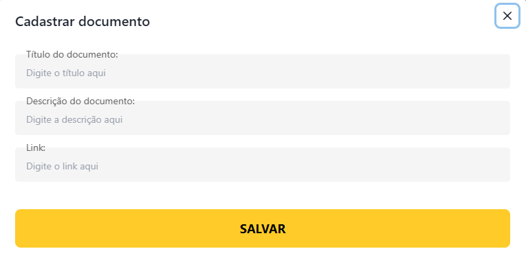 

# ARQUITETURA 

O sistema está estruturado com uma arquitetura de backend e frontend. A Figura a seguir ilustra a arquitetura e as tecnologias utilizadas em cada parte.

    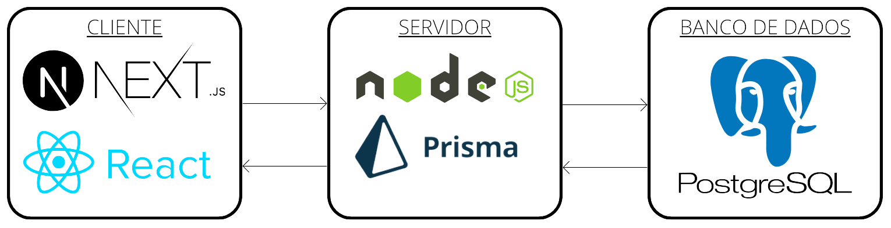

### Tecnologias:  
O backend deste projeto foi desenvolvido com as seguintes tecnologias:

- [Node.Js](https://nodejs.org/en/about)
- [Prisma](https://www.prisma.io/)

Para entender melhor sobre as tecnologias acima, acesse [aqui.](https://github.com/GabrielaMarangoni/TCC-Backend/blob/main/Backend/readme.md#tecnologias-utilizadas)

O frontend foi desenvolvido com as seguintes tecnologias:

- [Next.js](https://nextjs.org)
- [ReactJS](https://reactjs.org/)
- [Axios](https://github.com/axios/axios)
- [Tailwind CSS](https://tailwindcss.com)
- [ESlint](https://eslint.org/)
- [Remix](https://remixicon.com/)

Para entender melhor sobre as tecnologias acima, acesse [aqui.](https://github.com/GabrielaMarangoni/TCC-Frontend/blob/main/frontend/README.md#tecnologias-utilizadas)

# INSTALAÇÃO

### Backend 
Clique no link abaixo para acessar o passo a passo da instalação do sistema.
[Instalação](https://github.com/GabrielaMarangoni/TCC-Backend/blob/main/Backend/readme.md#instalação)

### Frontend 
Clique no link abaixo para acessar o passo a passo da instalação do sistema.
[Instalação](https://github.com/GabrielaMarangoni/TCC-Frontend/blob/main/frontend/README.md#instalação)